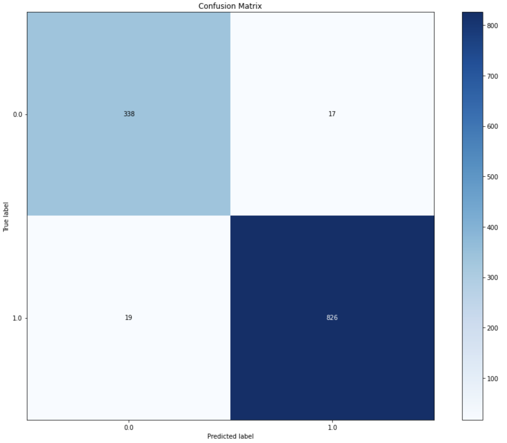
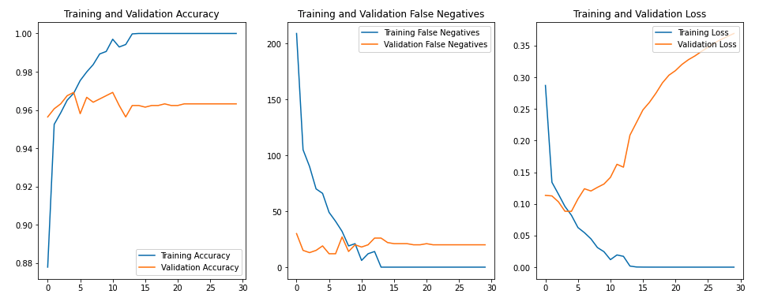

# **Image-Based Deep Learning: *Finding Pneumonia in Labeled Optical Coherence Tomography (OCT) and Chest X-Ray Images***

Analysis by Jonny Hofmeister for Flatiron School Phase 4 Project

This X-ray image data comes from [the Mendeley Website and contributors from UCSD.](https://data.mendeley.com/datasets/rscbjbr9sj/3)

## **Pneumonia in X-Rays**

While blood and sputum tests are used to confim pneumonia infections, chest X-rays of the lungs have long been used by doctors to help diagnose and determine the extent and location of the infection. 

*Can we use this labeled x-ray image data to train a machine learning model to recognize the infections?*
  - Assistance from models could help busy medical staff diagnose routine infections faster and smoother.
  - Also could help diagnose infections with a higher level of certainty - who wouldn't want their result confirmed by more that one source?

## **The Data**

This dataset, from University of California San Diego, Guangzhou Women and Children's Medical Center, contains 5840 labeled X-ray images. The images vary significantly in size and will be scaled down for input into the model. Visually based on the images, patients vary in age from babies to adults; but no other information is provided with the data besides the image file and class label - NORMAL or PNEUMONIA.

## **Modeling**

***Why a Nerual Network?***

Neural Networks and Deep Learning tools are currently the best we have at our dispoal for processing and learning patterns in image data. Tensorflow and Keras will be the deep learning packages used for this project.

I will create 2 models:
  1. A simple baseline network
      - A simple model with only a few hidden layers will show us the potential of the data without taking too much processing time.
  
  2. Convolutional Neural Network
      - Convolution is a common image processing technique that allows us to extract more localized patterns in 2D images
      - CNNs are very successful at tasks like this, and tuning one will likely produce our best results.

## **Results**

Both models did well with accuracy scores of 94% and 97% respectively. Given the medical context to our problem, Recall score is more important. Recall measures the amount of False Negatives out of total real positive cases. For the CNN, recall got as low as 17/843, or 97.9%. 

While a 98% recall score sounds great, this model could do much better. We can see this from how it evolved during training.

It is evident here that for the validation set, the model did not 'learn' and progress the same way the training set did. Adjustments should be made to ensure the best possible model is trained before deployment. Here are a few take-aways from the training:
  - Validation accuracy and number of FNs stayed fairly consistent through training. But while 96% accurate is good, not seeing any development through the models training epochs suggests that even though we have constructed a successful model, it didn't "learn" much from the data.
  - After only a few epochs, the model began to overfit the training data and get scores of 100%. Validation scores did not improve at all throughout training.
  - Another reason to suspect we have over-fit and over-trained this model is the increase in validatation loss as we go through more epochs. The accuracy stays the same, which means this increase in loss is a result of less certain of predictions (probabilities) of validation samples even if it is getting the same number correct.
  - One more thing to note is that the number of False Negatives stayed the same for the second have of training (20). While it is possible these are different samples, I suspect that the model is missing the same 20 each time. Whether it is possible to properly evaluate these images is something to quesiton, along with the possibility that a local minimum in False Negatives and accuracy was found, preventing the model from learning the context to properly classify these 20 outlier samples.

## **Next Steps**

Moving forward in createing a deployable model, we want to take steps to reduce overfitting and increase the certainty of our predictions in the validation data. Here are some options that I would explore:
  - Add Dropout layers to regularize training. These make the model 'forget' the values of nodes at a certain rate so they are trained again.
  - Include more image preprocessing. This could look like adjusting brightness or contrast so the necessary features are more easily recognizable by the model.
  - Reduce the complexity of the model by reducing the number of overall parameters. This could look like removing one or two of the 3 convolutional layers.
  - Increase the size of the dataset by including reflected images. In doing this we would certainly reduce the image dimensions so that training does not take absurdly long.
  - Try regularization techniques like Weight and Activity reglurization, which penalizes the model for too high of weight and activiation values. It is also possible to directly constrain the weight values for the model if we wished.
  - Test different batch sizes. Smaller batches backpropogate training information more frequently than larger batches (eg. the model always knows the direction of gradient descent for smalled batches). Tweaking this may help training, but I suspect it is not the main root of our overfitting problem.

Testing and combining these different options will help tune the model towards better performance. 

**Including LIME**

Using LIME is something that should also be included to help us evaluate models in the future. LIME allows us to see on the sample image which pixels weights are determined to be important and helps us confirm that the model is actually learning from pneumonia features and not just 'cheating' and using other nonsense background information to correctly classify images.

##### Thanks for reading!
